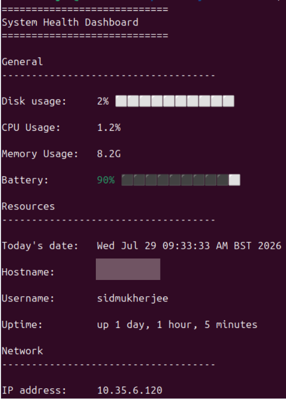

# System Monitor 

A lightweight system monitoring dashboard written in Bash that displays important system information directly in the terminal.

I built this project to improve my Bash scripting and Linux skills whilst also learning how to structure programs into reusable functions. 

## Project Goals

The aim of this project was to: 

- Improve my Bash scripting skills
- Practice writing functioning, maintainable code 
- Gain experience using Git and Github 
- Build a project suitable for a portfolio

## Features

- Displays current date and time 
- Shows current user and hostname 
- Displays system uptime
- Reports CPU usage 
- Reports memory usage 
- Displays disk usage 
- Shows battery percentage with colour coding
- DIsplays current IP address
- Includes reusable progress bars 
- Organised into functions 

## Technologies used 

- Bash
- Git 
- Github 
- Linux
- `awk`
- `grep`
- `bc` 
- `df`
- `free`
- `top`
- `ip`

## Project Structure 

The project is split into small, reusable functions that all have a single responsibility. 

| Function | Purpose | 
| ---------- | ---------- | 
| `getSysInfo()` | Collects all system information required by the dashboard. | 
| `printHeader()` | Prints the dashboard heading. |
| `printGeneralInfo()` | Displays general system information | 
| `printResourceInfo()` | Displays CPU, memory, disk and battery info | 
| `printNetworkInfo()` | Displays network info | 
| `setBatteryColour()` | Chooses battery colour based on battery percentage | 
| `createProgressBar()` | Creates reusable progress bar for percentage values | 
| `main()` | Controls execution of program | 

## Example Output 



## Installation 

Clone the repository: 

```bash
git clone https://github.com/Sid-Mukherjee/system-monitor.git
```

Move into the project the repository:

```bash 
cd system-monitor
```

Make the script executable:

```bash 
chmod +x system-monitor.sh
```

Run the dashboard:

```bash 
./system-monitor.sh
```

## Skills Demonstrated 

This project showcases experience with: 

- Bash scripting
- Linux CLI tools
- Git and Github
- Functions and modules
- Loops and conditional statements
- Command substitution 
- Shell pipelines 
- Passing command output through `awk` and `grep`
- Writing reusable code
- Documentation

## Challenges faced

While developing the project, I encountered many challenges:

- Calculating CPU usage from system stats
- Building the reusable progress bar function 
- Displaying coloured terminal output through ANSI escape codes

## Future Improvements

I plan on continuing to improve this project by adding:

- CPU and disk usage colour coding 
- Memory usage percentage with a progress bar 
- Live dashboard refresh mode 
- Command-line options such as `--help` and `--version`
- Improved terminal layout using Unicode box-drawing characters

## Author 

**Sid Mukherjee** 

Created as a personal project to strengthen Bash scripting, Linux and software engineering skills while building a portfolio of projects. 
